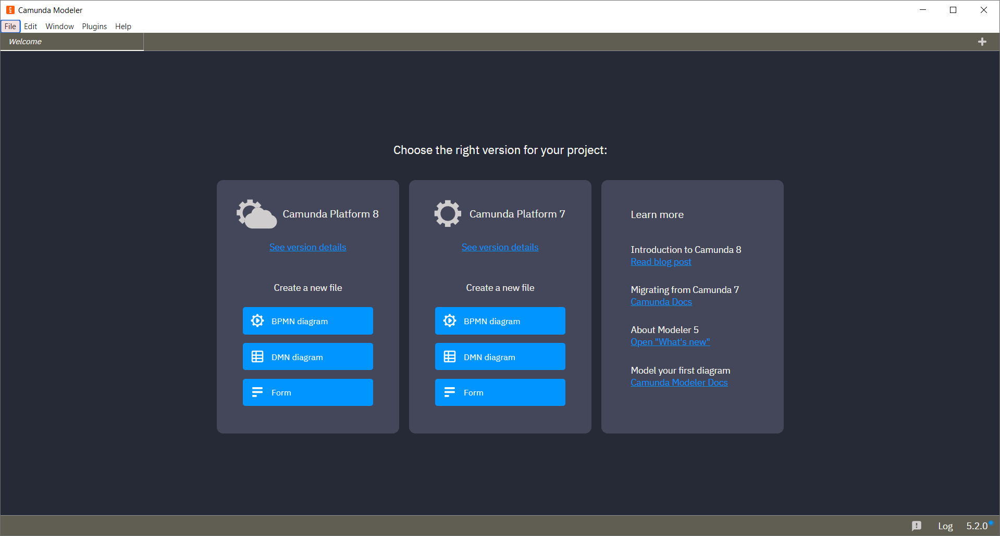
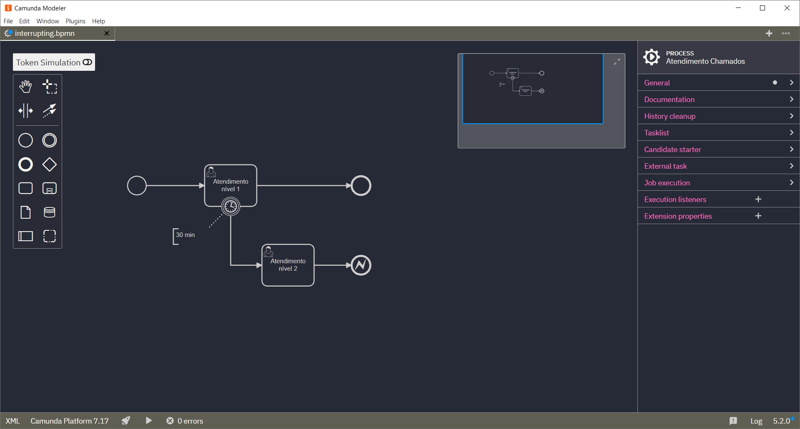
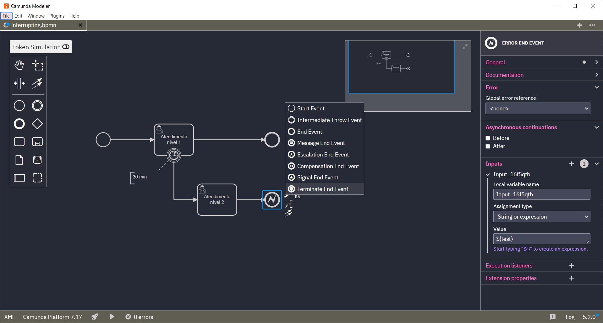
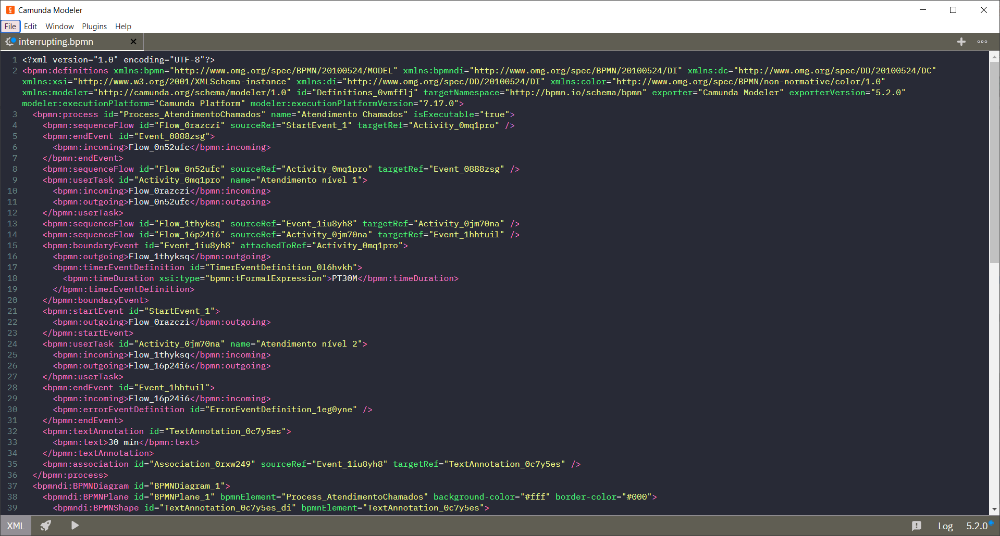

# Camunda Modeler Plugin - Dracula Theme

  

This plugin enables [Dracula](https://draculatheme.com/) inspired theme to [Camunda Modeler](https://github.com/camunda/camunda-modeler).

## How to use

1. Download and copy this repository into the `plugins` directory of the Camunda Modeler
2. Start the Camunda Modeler
3. That's it :smile:

### Installing on macOS

Open a Terminal window and run the following commands:

1. `cd ~/Library/Application Support/camunda-modeler`
2. `mkdir -p resources/plugins`
3. `cd resources/plugins`
4. `git clone https://github.com/camunda/camunda-modeler-token-simulation-plugin`

Restart Camunda Modeler.

## Licence

MIT
